#Statistical Analysis of US Traffic Accidents from 2017 to 2019

###Maria Pereyra & Group

### Introduction

Throughout the world, roads are shared by cars, buses, trucks, motorcycles, mopeds, pedestrians, animals, taxis, and other travelers. Travel made possible by motor vehicles supports economic and social development in many countries. However, each year, vehicles are involved in accidents and crashes that can be a result of a plethora of reasons.

In the United States, especially in major states and cities, we always hear of constant accidents happening and traffic issues throughout all hours of the day. We started to wonder, why all the accidents? What causes so much traffic accidents in the country?

Given our initial curiosity, we chose to analyze a countrywide traffic accident data set that covers 49 states of the USA. The traffic accidents data set had collected traffic accidents in the USA from February 2016 to June 2020, capturing more than 3.5 million rows of data, using two APIs that provide streaming traffic incident (or event) data. These APIs broadcast traffic data captured by a variety of entities, such as the US and state departments of transportation, law enforcement agencies, traffic cameras, and traffic sensors within the
road-networks.

### Hypothesis

-   **Null hypothesis** = There is no relationship between road accidents and various weather and road conditions.
-   **Alternative hypothesis** = There is a relationship between road accidents and weather and road conditions.

We begun this project with a descriptive analysis of the total USA road accidents, figuring out which variables had the biggest impacts on traffic accidents in America. We chose to first look into the seasons, months, times and locations (state) where most of the accidents occurred under, and then we conducted a Random Forest Model for the two states with the most traffic accidents, California and Texas. After we tested the variable importance for each, we continued with the multi-linear
models to test our hypothesis of the relationships between the road accidents and other independent variable included in the models.

### Exploratory Data Analysis

First, we wanted to investigate if one season had more accidents than another, given that we were expecting to see most of the accidents in the Fall or Winter. We created a Seasons column by defining respective months as Fall, Winter, Summer and Spring. However, when we plotted the accidents by season, we learned that though the Fall season did have the most accidents in the country across all years, it wasn’t as significant as we would have hoped. We initially may have thought it would be the Winter season given the infamous bad weather conditions, but considering that the entire country does not experience the same weather conditions across the seasons, we understood why this result was not significant.

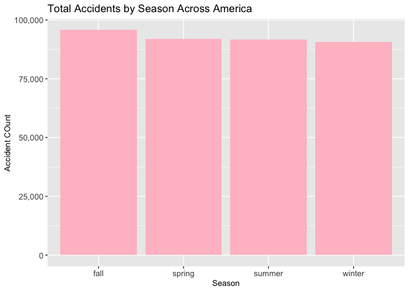

After learning that our initial prediction for most traffic accidents happening in the colder seasons was not entirely significant, we wanted to expand our analysis to verify the seasons data by seeing exactly which months had the highest accidents across 2017-2019. When doing so, we found out that the late Fall/Winter month had the most accidents, which correlates with the seasons data. However, because the entire country does not experience the same kind of winter, we decided to take a different approach.

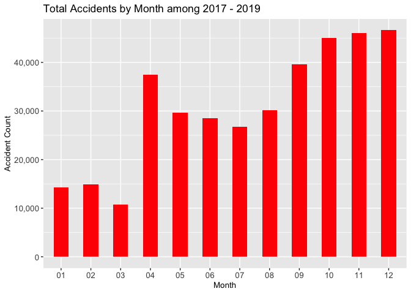

We plotted a bar graph to show at what times of the day were most of the traffic accidents happening across the country. Naturally, what we learned is that most accidents happened during rush hour times, 7-8 am and 4-6 pm, when drivers are going to and from work. This makes sense given that during rush hour times is when most of the vehicles are on the road, simultaneously. However, knowing the times that most traffic accidents occur did not explain the reason behind their occurrence.

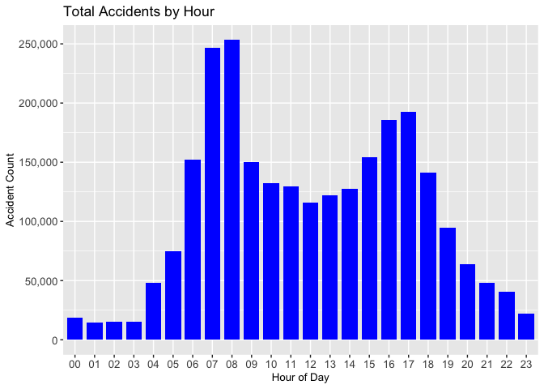

To continue our analysis to test whether or not weather and road conditions had an impact on traffic accidents, we continued to analyze where exactly most of the traffic accidents were happening in the country within 2017 through 2019. We plotted the number of accidents per state and we learned that California soared high, resulting in being the top state in the USA that had the most accidents in 2017-2019, with Texas ranking in second places.

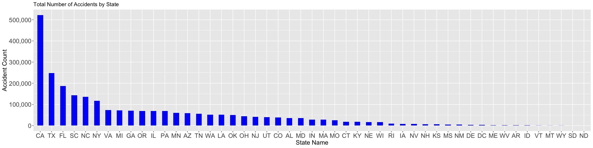

We continued our analysis on the traffic accidents in California. We first had to clean up our data set by filtering to work with only rows pertaining to the state of California, and finding the means of the columns in our data set. We wantes to work with the top weather condition variables respective to each state, like Cloudy or Rainy, for the state, as well as the top variables of road elements, like being near a traffic signal or a stop sign.

We plotted the most frequent weather variables in California to get a better look at the weather conditions that existed during the time of most of California’s traffic accidents between 2017 - 2019. From this plot, we see that most accidents in California happened on “Fair” days, with there not being such bad weather conditions as we initially expected. Because most of the accidents in California seemed to have happened without the impact of a bad weather condition, we decided to keep investigating to figure out which variables are behind the accidents in California.

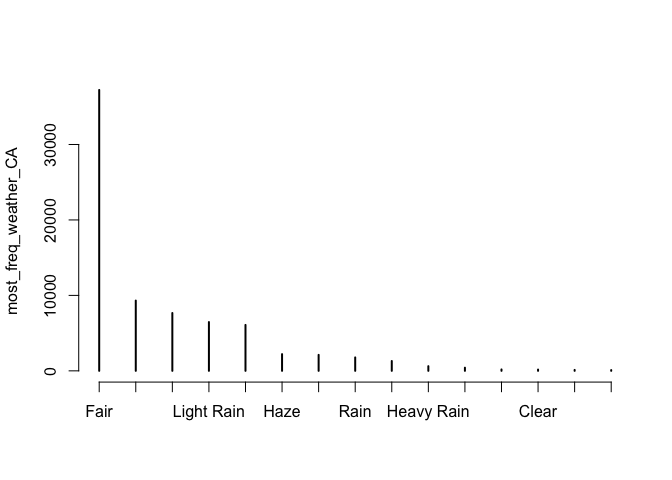

Similarly to how we foud the most frequent weather conditions that happened in California at the time of most of its traffic accidents, we wanted to learn the same for Texas. Among plotting this data, we learned that like California, most of the traffic accidents in Texas also occured on “Fair” days. This also does not allow us to confirm our prediction that most traffic accidents were happening on bad weather conditions, which meant that we had to continue expanding our investigation to discover which variables have the most impact on
traffic accidents in the country.

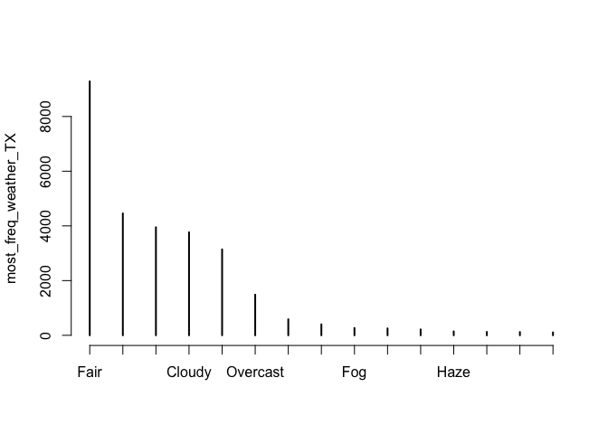

### Statistical Analysis for California

In order to continue expanding our analysis to figure out which were the most important variables that seemed to cause the most traffic accidents in California between 2017 - 2019, we conducted a Random Forest model as well as applying a regression tree to the variables from the data.

To begin our modeling, we split our data between a training and test set, where each one contains 80% and 20% of the data, respectively.

We wanted our random forest to be its best and most accurate version, so we found the mtry value for California which was 33, and we applied that to our random forest model.

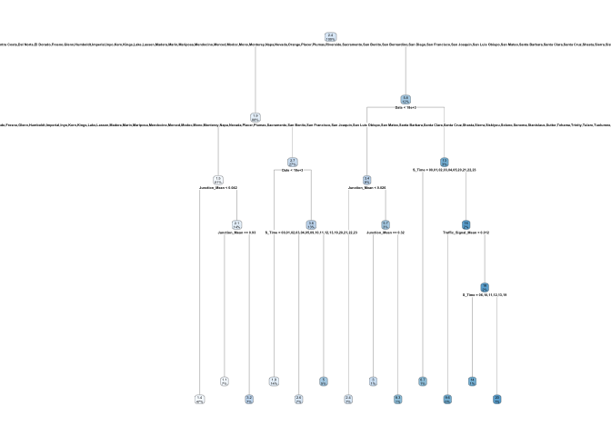

    ## [1] 1.995615

From this regression tree, we observed that even when given all the variables to evaluate the tree, it only chose the variables: county, junction, date and start time as these are the variables where the splits happen.

We could see how the tree started by partitioning the data by county in CA with junction means of \>\< or = 0.04166 to \>\< or = 0.9285. It followed by splitting the data by county in CA with a date \>\< or = 18141.5 and s_time = 00 to 24 and it kept splitting the data by county in CA depending on their junction mean, date and s_time. Junction means, date and start times seemed to have a high importance as variables impacting traffic accidents in California.

Our regression tree had a RSME score of \~2.03.

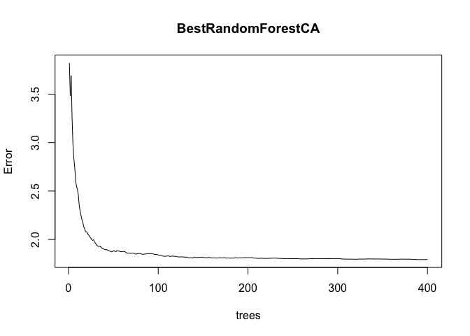

We ran an initial random forest with the recommended standard 500 trees. However, in this model, we found that the data had 11 splits and a percentage-var-explained of 82.75%. After getting the OOB error, we noticed that the out-of-bag error initially drops down and then, becomes more or less constant. So, we are not able to improve this error after about 400 trees. We found the best mtry value and decided to run a new random forest with the new mtry value of 33 for California and an nTree value of 400.

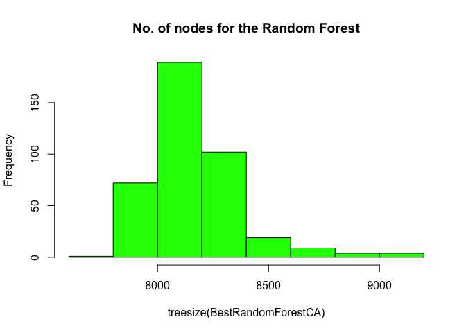

With this histogram, we get to see the distribution of number on nodes in each of those 400 trees that we have and in fact, the biggest bar is close to 8500. There are more than 80 trees that contain slightly over 8400 nodes in them. Also, there are a few trees with close to 8000 nodes and there a few trees which have more than 9000.

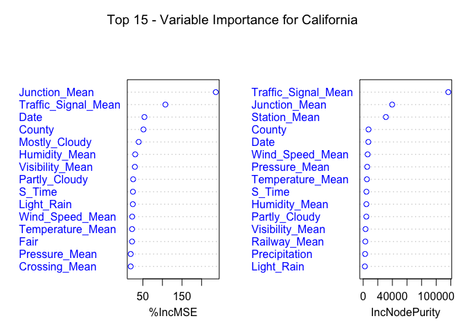

For California, we used the varImpPlot function to allow us to see which variables from the data set seemed to truly have the biggest impact on the traffic accidents happening. Running the varImpPlot and selecting the top 15 variables with the highest impact, we saw that being near Junctions and Traffic Signals had high impacts, as well as the Visibility on the specific day. Naturally, the variable County ranked very high as well.

Given the variables shown, it did seem that  road conditions and weather conditions have an influence on traffic accidents after all, at least in California, with location and time playing a huge part as well.

    ## `stat_bin()` using `bins = 30`. Pick better value with `binwidth`.

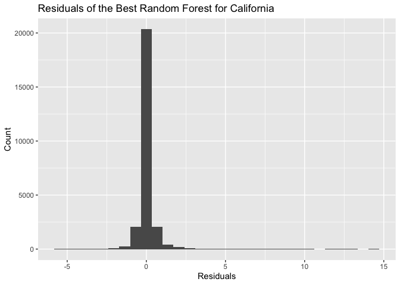

    ## function (pred, obs, na.rm = FALSE) 
    ## sqrt(mean((pred - obs)^2, na.rm = na.rm))
    ## <bytecode: 0x127c8a5b0>
    ## <environment: namespace:caret>

    ## [1] 1.371005

We also wanted to prove just how accurate our random forest model was, and how well it fit our data. We plotted the residuals as well, and we see from this graph that though not perfect, since it doesn’t entirely equal to 0, it is a normally distributed graph. This meant that our model did accurate fit our data, scoring a RMSE value of \~1.36.

### Statistical Analysis for Texas

Continuing to expand our analysis to see why Texas ranked the second highest state in the country with the most traffic accidents, by figuring out which were the most important variables, we conducted a similar analysis process to the one we used for California, by conductinga Random Forest model as well as applying a regression tree to the variables from the data.

We split our data between a training and test set, where each one contains 80% and 20% of the data, respectively.

We wanted our random forest to be its best and most accurate version, so we found the mtry value for Texas which was 35, and we applied that to our random forest model.

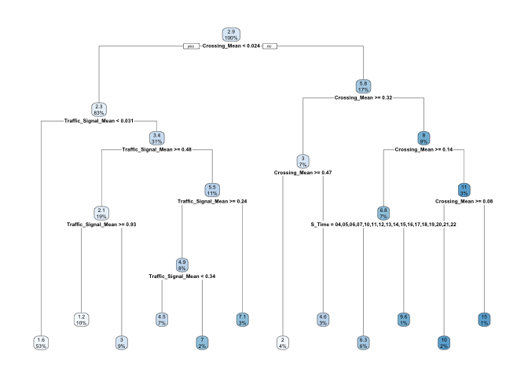

From this regression tree, we can observe that even when given all the variables to evaluate the tree, it only chose the variables: crossing mean, s_time and traffic signal mean as these were the variables where the splits happen. We can observe how the tree started by partitioning the data by crossing mean \<0.0238 and continued by splitting by the traffic signal mean \<0.03125 or \>=0.03125, it follows by splitting the data by traffic signal mean \>=0.4807 and crossing mean of \>=0.0238, it
keeps splitting the data by crossing mean, traffic signal mean and s_time.

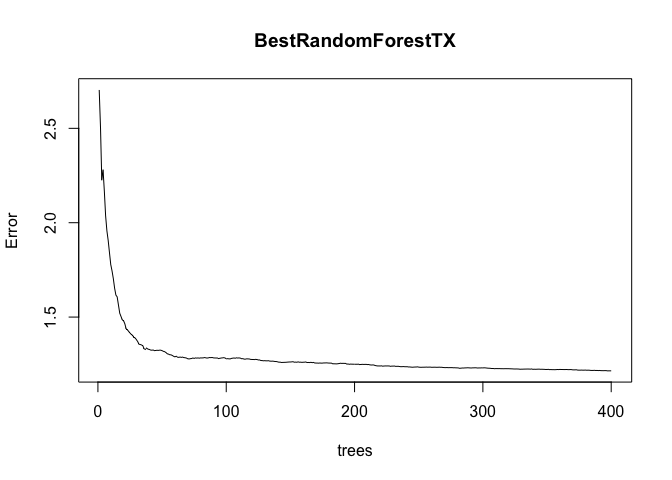

For Texas, we ran an initial random forest with the recommended standard 500 trees,where we had 11 splits and a percentage-var-explained of 83.66%. After getting the OOB error, we noticed that the out-of-bag error initially drops down and becomes more or less constant. We are not able to improve this error after about 400 trees. We found the best mtry value and decided to run a new random forest with the new mtry value of 35 for Texas and an nTree value of 400. The new percentage-var-explained is 84.66%, which is higher than the previous.

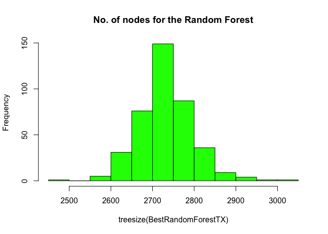

On the histogram above, we get to see the distribution of number on nodes in each of 400 trees that we have and the biggest bar is close to 2800. There are more then 80 trees that contain around 2800 nodes in them. Also there are a few trees with close to 2500 nodes and there a few trees which have around 3000.

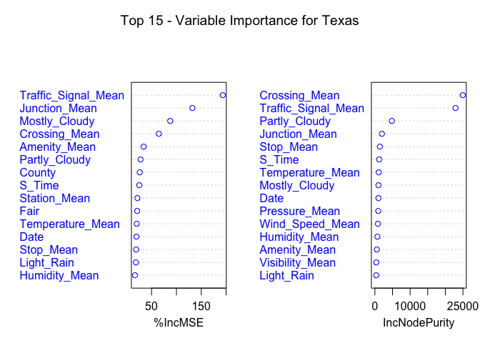

Similarly to how we found the top variables for California, we applied the same method of using the varImpPlot function to allow us to see which variables from the data set seemed to truly have the biggest impact on the traffic accidents happening in Texas. Running the varImpPlot and selecting the top 15 variables with the highest impact, we saw that being near Traffic Signals and Crossings were varibles of great influence for traffic accidents, as well as a proximity to Junctions, similar to California.

Given the variables shown, we discover that road conditions had the most influence on traffic accidents in Texas, even more so that in California. For Texas, 4 of it’s top 5 variables were factors of road condition.

    ## `stat_bin()` using `bins = 30`. Pick better value with `binwidth`.

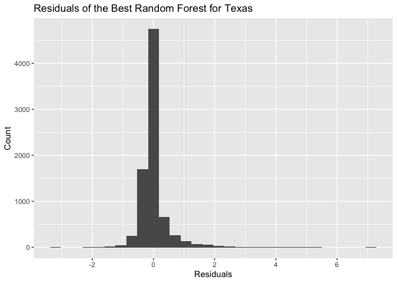

    ## [1] 1.079008

We wanted to tet just how well our random forest model for Texas was, and how well it fit this data. We plotted the residuals as well here, and we see from this graph that though not perfect either, it seems to
still be very accurate, scoring a RMSE value of \~0.74, much lower than the previous, making this model even more accurate and closely-fitting to our data.

### Multi-Linear Model for California

    ## 
    ## Call:
    ## lm(formula = Accident_Count ~ Junction_Mean + Traffic_Signal_Mean + 
    ##     County + Date + Visibility_Mean, data = trainingCA)
    ## 
    ## Residuals:
    ##    Min     1Q Median     3Q    Max 
    ## -5.970 -1.069 -0.388  0.532 51.929 
    ## 
    ## Coefficients:
    ##                         Estimate Std. Error t value Pr(>|t|)    
    ## (Intercept)           -3.786e+01  1.140e+00 -33.197  < 2e-16 ***
    ## Junction_Mean          1.027e-01  5.874e-02   1.748 0.080391 .  
    ## Traffic_Signal_Mean   -1.461e-02  7.995e-02  -0.183 0.855045    
    ## CountyAlpine          -1.707e+00  9.231e-01  -1.850 0.064373 .  
    ## CountyAmador          -1.557e+00  4.929e-01  -3.158 0.001592 ** 
    ## CountyButte           -1.051e+00  2.317e-01  -4.535 5.79e-06 ***
    ## CountyCalaveras       -1.644e+00  3.220e-01  -5.105 3.33e-07 ***
    ## CountyColusa          -1.659e+00  3.926e-01  -4.226 2.39e-05 ***
    ## CountyContra Costa    -6.061e-01  1.030e-01  -5.887 3.98e-09 ***
    ## CountyDel Norte       -1.710e+00  4.855e-01  -3.523 0.000428 ***
    ## CountyEl Dorado       -1.480e+00  2.375e-01  -6.232 4.67e-10 ***
    ## CountyFresno          -1.201e+00  1.253e-01  -9.584  < 2e-16 ***
    ## CountyGlenn           -1.237e+00  4.885e-01  -2.532 0.011346 *  
    ## CountyHumboldt        -1.461e+00  2.108e-01  -6.934 4.20e-12 ***
    ## CountyImperial        -1.549e+00  1.237e+00  -1.253 0.210341    
    ## CountyInyo            -1.788e+00  5.800e-01  -3.082 0.002058 ** 
    ## CountyKern            -1.336e+00  1.245e-01 -10.731  < 2e-16 ***
    ## CountyKings           -1.729e+00  2.858e-01  -6.051 1.46e-09 ***
    ## CountyLake            -1.602e+00  2.392e-01  -6.698 2.16e-11 ***
    ## CountyLassen          -1.733e+00  4.475e-01  -3.873 0.000108 ***
    ## CountyLos Angeles      3.434e+00  8.318e-02  41.284  < 2e-16 ***
    ## CountyMadera          -1.664e+00  2.003e-01  -8.311  < 2e-16 ***
    ## CountyMarin           -1.376e+00  1.606e-01  -8.566  < 2e-16 ***
    ## CountyMariposa        -1.803e+00  4.533e-01  -3.977 7.00e-05 ***
    ## CountyMendocino       -1.483e+00  2.217e-01  -6.688 2.31e-11 ***
    ## CountyMerced          -1.606e+00  1.877e-01  -8.558  < 2e-16 ***
    ## CountyModoc           -2.041e+00  8.355e-01  -2.442 0.014602 *  
    ## CountyMono            -1.762e+00  4.130e-01  -4.265 2.00e-05 ***
    ## CountyMonterey        -1.317e+00  1.364e-01  -9.652  < 2e-16 ***
    ## CountyNapa            -1.431e+00  1.768e-01  -8.097 5.88e-16 ***
    ## CountyNevada          -1.548e+00  2.489e-01  -6.218 5.10e-10 ***
    ## CountyOrange           1.966e-01  1.006e-01   1.954 0.050734 .  
    ## CountyPlacer          -1.452e+00  1.710e-01  -8.493  < 2e-16 ***
    ## CountyPlumas          -1.335e+00  4.496e-01  -2.970 0.002978 ** 
    ## CountyRiverside       -1.741e-01  1.025e-01  -1.698 0.089539 .  
    ## CountySacramento      -6.412e-01  1.122e-01  -5.713 1.12e-08 ***
    ## CountySan Benito      -1.767e+00  3.200e-01  -5.523 3.36e-08 ***
    ## CountySan Bernardino  -8.998e-02  1.031e-01  -0.873 0.382750    
    ## CountySan Diego        1.695e-01  1.028e-01   1.649 0.099245 .  
    ## CountySan Francisco   -1.235e+00  1.293e-01  -9.549  < 2e-16 ***
    ## CountySan Joaquin     -1.012e+00  1.182e-01  -8.566  < 2e-16 ***
    ## CountySan Luis Obispo -1.606e+00  1.698e-01  -9.455  < 2e-16 ***
    ## CountySan Mateo       -1.016e+00  1.177e-01  -8.631  < 2e-16 ***
    ## CountySanta Barbara   -1.499e+00  1.519e-01  -9.866  < 2e-16 ***
    ## CountySanta Clara     -4.988e-01  1.027e-01  -4.859 1.19e-06 ***
    ## CountySanta Cruz      -1.384e+00  1.509e-01  -9.169  < 2e-16 ***
    ## CountyShasta          -1.703e+00  2.213e-01  -7.693 1.48e-14 ***
    ## CountySierra          -2.053e+00  1.046e+00  -1.962 0.049732 *  
    ## CountySiskiyou        -1.912e+00  3.928e-01  -4.867 1.14e-06 ***
    ## CountySolano          -1.061e+00  1.251e-01  -8.475  < 2e-16 ***
    ## CountySonoma          -1.269e+00  1.270e-01  -9.985  < 2e-16 ***
    ## CountyStanislaus      -1.367e+00  1.377e-01  -9.930  < 2e-16 ***
    ## CountySutter          -1.699e+00  3.326e-01  -5.108 3.28e-07 ***
    ## CountyTehama          -1.678e+00  3.302e-01  -5.081 3.78e-07 ***
    ## CountyTrinity         -1.855e+00  5.800e-01  -3.198 0.001385 ** 
    ## CountyTulare          -1.595e+00  1.729e-01  -9.226  < 2e-16 ***
    ## CountyTuolumne        -1.688e+00  3.022e-01  -5.586 2.35e-08 ***
    ## CountyVentura         -1.191e+00  1.260e-01  -9.452  < 2e-16 ***
    ## CountyYolo            -1.351e+00  1.652e-01  -8.180 2.98e-16 ***
    ## CountyYuba            -1.716e+00  2.570e-01  -6.676 2.50e-11 ***
    ## Date                   2.283e-03  6.392e-05  35.709  < 2e-16 ***
    ## Visibility_Mean       -7.022e-02  6.535e-03 -10.745  < 2e-16 ***
    ## ---
    ## Signif. codes:  0 '***' 0.001 '**' 0.01 '*' 0.05 '.' 0.1 ' ' 1
    ## 
    ## Residual standard error: 2.761 on 25551 degrees of freedom
    ## Multiple R-squared:  0.2394, Adjusted R-squared:  0.2375 
    ## F-statistic: 131.8 on 61 and 25551 DF,  p-value: < 2.2e-16

Our p-value of the F-statistic is \<2.2e-16, which is conveys a high significance. This means that, at least, one of the predictor variables is significantly related to the outcome variable, we will analize this further by seeing the coefficients table which shows the estimates of regession beta coefficients and the associated t-static p-values.

    ##                            Estimate   Std. Error     t value      Pr(>|t|)
    ## (Intercept)           -37.856658770 1.140366e+00 -33.1969491 1.265266e-236
    ## Junction_Mean           0.102705422 5.873937e-02   1.7484937  8.039058e-02
    ## Traffic_Signal_Mean    -0.014605162 7.994611e-02  -0.1826876  8.550446e-01
    ## CountyAlpine           -1.707422443 9.230965e-01  -1.8496684  6.437290e-02
    ## CountyAmador           -1.556613349 4.929489e-01  -3.1577579  1.591725e-03
    ## CountyButte            -1.050527062 2.316510e-01  -4.5349555  5.787730e-06
    ## CountyCalaveras        -1.644074881 3.220465e-01  -5.1050859  3.330147e-07
    ## CountyColusa           -1.658895744 3.925624e-01  -4.2258138  2.389043e-05
    ## CountyContra Costa     -0.606143265 1.029636e-01  -5.8869691  3.982543e-09
    ## CountyDel Norte        -1.710452733 4.855315e-01  -3.5228461  4.276842e-04
    ## CountyEl Dorado        -1.480291838 2.375169e-01  -6.2323649  4.666219e-10
    ## CountyFresno           -1.201342493 1.253459e-01  -9.5842179  1.013391e-21
    ## CountyGlenn            -1.237005716 4.885421e-01  -2.5320352  1.134620e-02
    ## CountyHumboldt         -1.461473739 2.107831e-01  -6.9335420  4.201981e-12
    ## CountyImperial         -1.549275321 1.236789e+00  -1.2526592  2.103412e-01
    ## CountyInyo             -1.787525080 5.799712e-01  -3.0820930  2.057693e-03
    ## CountyKern             -1.335631926 1.244688e-01 -10.7306528  8.335499e-27
    ## CountyKings            -1.729135975 2.857528e-01  -6.0511601  1.458068e-09
    ## CountyLake             -1.602402400 2.392365e-01  -6.6979852  2.156976e-11
    ## CountyLassen           -1.733298137 4.475382e-01  -3.8729610  1.077889e-04
    ## CountyLos Angeles       3.433912424 8.317800e-02  41.2839012  0.000000e+00
    ## CountyMadera           -1.664399397 2.002528e-01  -8.3114904  9.914948e-17
    ## CountyMarin            -1.376123641 1.606483e-01  -8.5660656  1.130229e-17
    ## CountyMariposa         -1.802676124 4.532659e-01  -3.9770833  6.995785e-05
    ## CountyMendocino        -1.482890698 2.217273e-01  -6.6879045  2.310587e-11
    ## CountyMerced           -1.606273558 1.876870e-01  -8.5582562  1.209226e-17
    ## CountyModoc            -2.040569245 8.355248e-01  -2.4422604  1.460234e-02
    ## CountyMono             -1.761575142 4.129943e-01  -4.2653735  2.002851e-05
    ## CountyMonterey         -1.316903798 1.364333e-01  -9.6523621  5.237830e-22
    ## CountyNapa             -1.431270734 1.767663e-01  -8.0969656  5.883782e-16
    ## CountyNevada           -1.547946532 2.489317e-01  -6.2183576  5.101634e-10
    ## CountyOrange            0.196594714 1.006210e-01   1.9538139  5.073413e-02
    ## CountyPlacer           -1.452446107 1.710180e-01  -8.4929422  2.122688e-17
    ## CountyPlumas           -1.335435981 4.496029e-01  -2.9702563  2.978279e-03
    ## CountyRiverside        -0.174118025 1.025491e-01  -1.6978996  8.953889e-02
    ## CountySacramento       -0.641154094 1.122287e-01  -5.7129232  1.122850e-08
    ## CountySan Benito       -1.767282190 3.199621e-01  -5.5234110  3.357176e-08
    ## CountySan Bernardino   -0.089979184 1.030859e-01  -0.8728565  3.827495e-01
    ## CountySan Diego         0.169473941 1.027997e-01   1.6485840  9.924519e-02
    ## CountySan Francisco    -1.234794861 1.293107e-01  -9.5490518  1.422064e-21
    ## CountySan Joaquin      -1.012258763 1.181710e-01  -8.5660508  1.130374e-17
    ## CountySan Luis Obispo  -1.605581589 1.698144e-01  -9.4549177  3.501125e-21
    ## CountySan Mateo        -1.015992039 1.177135e-01  -8.6310585  6.426485e-18
    ## CountySanta Barbara    -1.498799334 1.519209e-01  -9.8656566  6.445238e-23
    ## CountySanta Clara      -0.498831124 1.026592e-01  -4.8590995  1.186193e-06
    ## CountySanta Cruz       -1.383507621 1.508975e-01  -9.1685285  5.146089e-20
    ## CountyShasta           -1.702725748 2.213214e-01  -7.6934540  1.483720e-14
    ## CountySierra           -2.053029145 1.046209e+00  -1.9623513  4.973244e-02
    ## CountySiskiyou         -1.911555406 3.927618e-01  -4.8669590  1.140040e-06
    ## CountySolano           -1.060588627 1.251417e-01  -8.4750998  2.473604e-17
    ## CountySonoma           -1.268566891 1.270453e-01  -9.9851577  1.954314e-23
    ## CountyStanislaus       -1.367082002 1.376730e-01  -9.9299227  3.398507e-23
    ## CountySutter           -1.698804210 3.325852e-01  -5.1078772  3.281389e-07
    ## CountyTehama           -1.677862040 3.302143e-01  -5.0811304  3.778367e-07
    ## CountyTrinity          -1.854789645 5.799579e-01  -3.1981454  1.384831e-03
    ## CountyTulare           -1.594994899 1.728881e-01  -9.2255897  3.031716e-20
    ## CountyTuolumne         -1.688177409 3.022359e-01  -5.5856276  2.352259e-08
    ## CountyVentura          -1.190552117 1.259641e-01  -9.4515183  3.616325e-21
    ## CountyYolo             -1.351003481 1.651692e-01  -8.1795146  2.981128e-16
    ## CountyYuba             -1.716130157 2.570465e-01  -6.6763410  2.500006e-11
    ## Date                    0.002282614 6.392302e-05  35.7087916 1.440536e-272
    ## Visibility_Mean        -0.070224494 6.535281e-03 -10.7454445  7.106814e-27

Looking at the above summary, changes in Traffic_Signal_Mean and Date are significantly associated to changes in the Accident count, while changes in the County and Visibility_Mean are not as significant with the total number of accidents. Therefore, we have removed all the variables, but Traffic_Signal_Mean and Date to produce a better model.

The confidence interval of the model can be extracted as follows:

    ## 
    ## Call:
    ## lm(formula = Accident_Count ~ Traffic_Signal_Mean + Date, data = trainingCA)
    ## 
    ## Residuals:
    ##    Min     1Q Median     3Q    Max 
    ## -1.989 -1.520 -0.810  0.268 56.348 
    ## 
    ## Coefficients:
    ##                       Estimate Std. Error t value Pr(>|t|)    
    ## (Intercept)         -2.095e+01  1.252e+00  -16.74  < 2e-16 ***
    ## Traffic_Signal_Mean  3.383e-01  8.925e-02    3.79 0.000151 ***
    ## Date                 1.294e-03  6.950e-05   18.62  < 2e-16 ***
    ## ---
    ## Signif. codes:  0 '***' 0.001 '**' 0.01 '*' 0.05 '.' 0.1 ' ' 1
    ## 
    ## Residual standard error: 3.14 on 25610 degrees of freedom
    ## Multiple R-squared:  0.01407,    Adjusted R-squared:  0.01399 
    ## F-statistic: 182.7 on 2 and 25610 DF,  p-value: < 2.2e-16

    ##                             2.5 %        97.5 %
    ## (Intercept)         -23.406208422 -18.498407465
    ## Traffic_Signal_Mean   0.163329316   0.513215437
    ## Date                  0.001157657   0.001430097

By obtaining the RMSE of both the models and comparing them we can confirm that one is better than the other. In our case, the RMSE of model MC_CA2 is higher than our model MC_CA. Therefore, our model ML_CA2 is better than ML_CA.

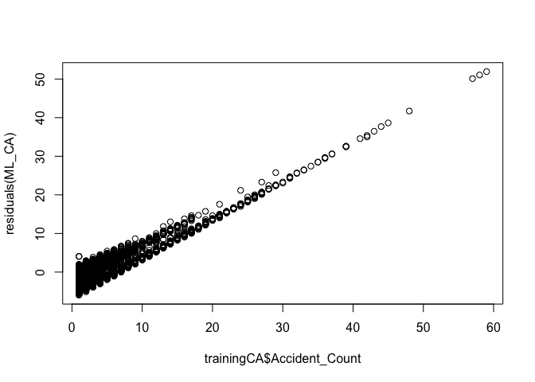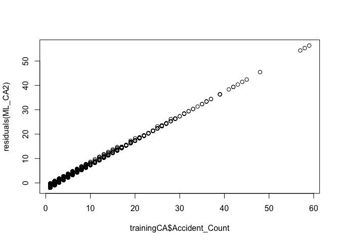

    ## [1] 2.785887

    ## [1] 3.126573

When we initially ran the model with all variables, we saw that the residuals were more spread out. When running the model with only the
most significant variables, the residuals are closer to eachother.

Our models ML_CA and ML_CA2 score RMSE values of 2.75 and 3.15, respectively.

### Multi-Linear Model for Texas

    ## 
    ## Call:
    ## lm(formula = Accident_Count ~ Traffic_Signal_Mean + Junction_Mean + 
    ##     Mostly_Cloudy + Crossing_Mean + Light_Rain, data = trainingTX)
    ## 
    ## Residuals:
    ##     Min      1Q  Median      3Q     Max 
    ## -3.7446 -1.6850 -0.9356  0.6748 19.3357 
    ## 
    ## Coefficients:
    ##                     Estimate Std. Error t value Pr(>|t|)    
    ## (Intercept)          2.68495    0.04567  58.790  < 2e-16 ***
    ## Traffic_Signal_Mean  0.50126    0.09623   5.209 1.95e-07 ***
    ## Junction_Mean       -0.44673    0.17000  -2.628  0.00861 ** 
    ## Mostly_Cloudy       -0.01980    0.09791  -0.202  0.83972    
    ## Crossing_Mean        1.55837    0.18892   8.249  < 2e-16 ***
    ## Light_Rain          -0.24467    0.10664  -2.294  0.02179 *  
    ## ---
    ## Signif. codes:  0 '***' 0.001 '**' 0.01 '*' 0.05 '.' 0.1 ' ' 1
    ## 
    ## Residual standard error: 2.788 on 8030 degrees of freedom
    ## Multiple R-squared:  0.0192, Adjusted R-squared:  0.01859 
    ## F-statistic: 31.44 on 5 and 8030 DF,  p-value: < 2.2e-16

Our p-value of the F-statistic is \<2.2e-16, which is highly significant. this means that, at least, one of the predictor variables is significantly related to the outcome variable, we will analyze this further by seeing the coefficients table, which shows the estimate of regression beta coefficients and the associated t-static p-values.

It can be seen that, changes in Traffic_Signal and Light rain are significantly associated to changes in the Accident count, while changes in the Junction, weather type: mostly cloudy and light rain are not significantly associated with the accidents count.

As the junction mean and weather conditions:mostly cloudy and light rain variables are not significant, it is possible to remove them from the model. We see the summary, below.

    ## 
    ## Call:
    ## lm(formula = Accident_Count ~ Traffic_Signal_Mean + Crossing_Mean, 
    ##     data = trainingTX)
    ## 
    ## Residuals:
    ##     Min      1Q  Median      3Q     Max 
    ## -3.7153 -1.6238 -0.8862  0.5909 19.3047 
    ## 
    ## Coefficients:
    ##                     Estimate Std. Error t value Pr(>|t|)    
    ## (Intercept)          2.62375    0.03910  67.099  < 2e-16 ***
    ## Traffic_Signal_Mean  0.52486    0.09566   5.487 4.21e-08 ***
    ## Crossing_Mean        1.56668    0.18898   8.290  < 2e-16 ***
    ## ---
    ## Signif. codes:  0 '***' 0.001 '**' 0.01 '*' 0.05 '.' 0.1 ' ' 1
    ## 
    ## Residual standard error: 2.789 on 8033 degrees of freedom
    ## Multiple R-squared:  0.01772,    Adjusted R-squared:  0.01747 
    ## F-statistic: 72.45 on 2 and 8033 DF,  p-value: < 2.2e-16

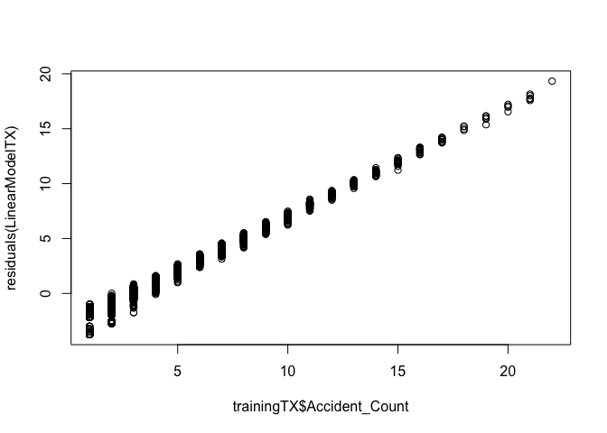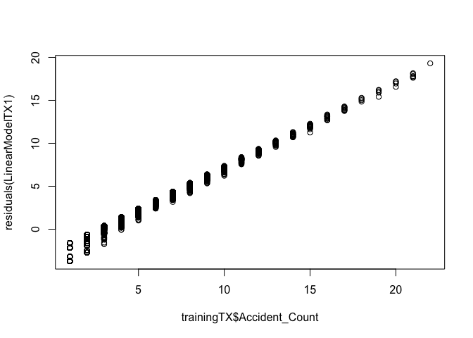

    ## [1] 2.605132

    ## [1] 2.605414

When we initially ran the model with all variables, we saw that the residuals were more spread out. When running the model with only the most significant variables, the residuals are closer to each other here, as well.

Our models LinearModelTX and LinearModelTX1 both score RMSE values of 2.76.

### Conclusions

-   **Statistical conclusions for California:** From our model we  observed that the p-value is statistically significant, p-value \<2.2e-16. This means the p-value is a lot less than 0.05, which means we have sufficient evidence to reject the null hypothesis that β= 0. Hence, there is a significant relationship between the variables and accidents in the multi-linear regression model.

-   **Statistical conclusions for Texas:** From our model we observed that p-value is statistically significant, p-value \< 2.2e-16. This means the p-value is a lot less than 0.05, which means we have sufficient evidence to reject the null hypothesis that β = 0. Hence there is a significant relationship between the variables and accidents in the multilinear regression model.
